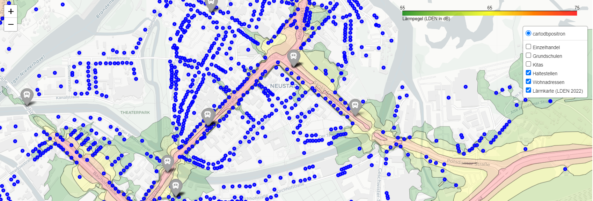
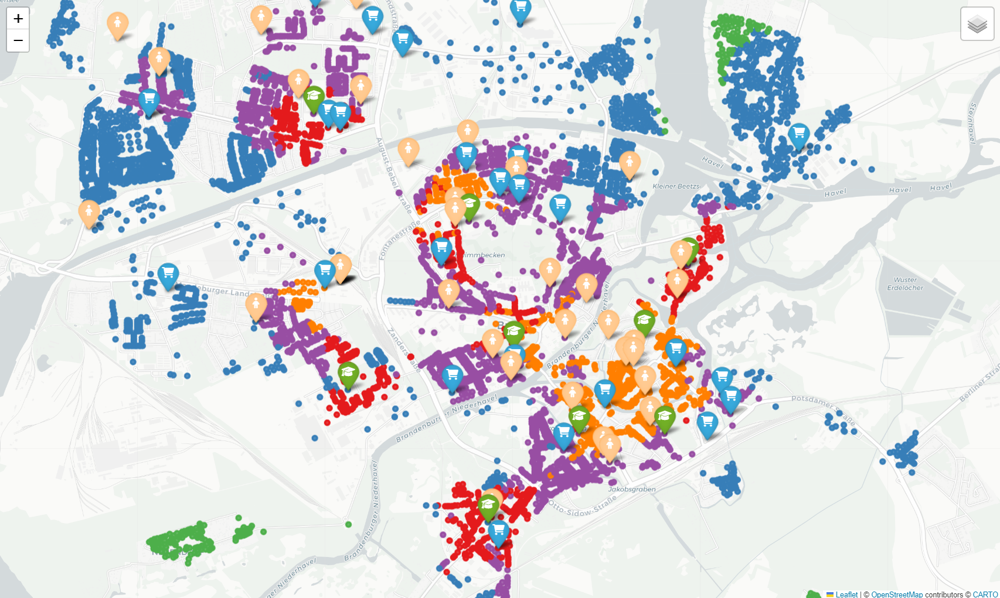
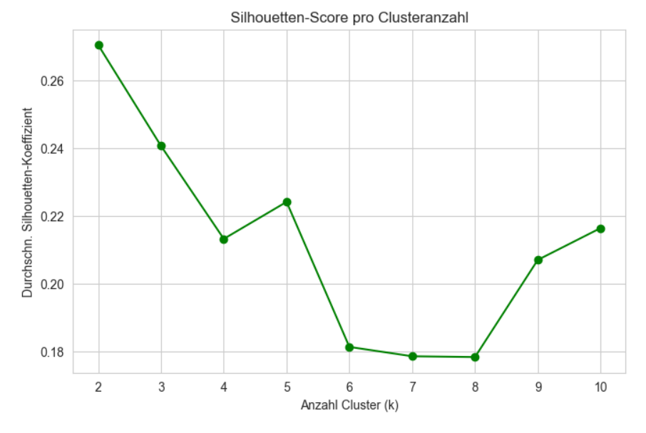
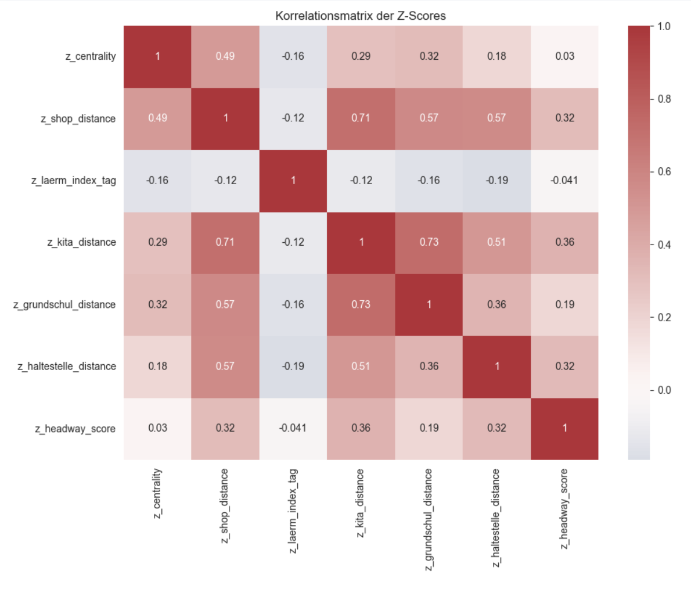
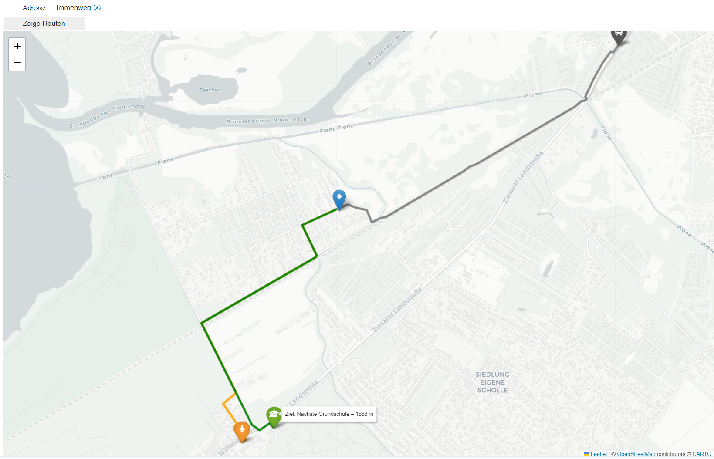

# Wohnlagen-Analyse
Ein Projekt zur systematischen Bewertung von Wohnlagen in der Stadt Brandenburg an der Havel anhand objektiver Kriterien.

## Wohnlagenmodell
Hier wird das eigentliche Modell beschrieben. Die Kombination von objektiven Daten, Clustering und Validierung soll ein robustes, reproduzierbares und transparentes Bewertungsmodell schaffen. So können Veränderungen (z. B. neue Supermärkte, Schließungen von Kitas, geänderte Verkehrsführung) langfristig in die Bewertung integriert werden.

### Kriterien
Das Modell zur Bewertung der Wohnlagen bezieht bereits die folgenden Kriterien ein (Distanzen immer in Metern):
- Fußläufige Distanz zum Zentrum (Jahrtausendbrücke)
- Kitas und Schulen
    - Fußläufige Distanz zur nächstgelegenen Kita
    - Fußläufige Distanz zur nächstgelegenen Schule
    - Anzahl Kitas im Umkreis von 500, 800 und 1000 Metern
    - Anzahl Schulen im Umkreis von 500, 800 und 1000 Metern
- Einzelhandel
    - Fußläufige Distanz zum nächsten Einzelhandel
    - Anzahl von Einzelhandelsmärkten im Umkreis von 500 und 800 Metern
- ÖPNV
    - Anzahl von ÖPNV-Haltestellen (Bus und Straßenbahn) im Umkreis von 500 und 800 Metern
    - ÖPNV-Taktung der nächsten Haltestelle morgens (6 - 9 Uhr) in Minuten
    - ÖPNV-Taktung der nächsten Haltestelle abends (16 - 19 Uhr) in Minuten
- Lärm-Index (laut [Lärmkartierung 2022](https://mleuv.brandenburg.de/mleuv/de/umwelt/immissionsschutz/laerm/umgebungslaerm/laermkartierung/#))



Abbildung 1: Visualisierung des gemessenen Lärm-Index mit Adressen

Das Modell kann beliebig um neue Kriterien erweitert werden. Denkbar sind zum Beispiel auch neue Kriterien wie "zwischen der Adresse und dem Zentrum gibt es einen Bahnübergang" oder Ähnliches. Dadurch kann die Trennschärfe des Modells verbessert werden, was anhand der Gütemaße (s.u.) sichtbar werden sollte.

Die **Kriterien fließen gewichtet in das Modell** ein. Diese Gewichtung ist nur vorläufig definiert und sollte für den langfristigen Einsatz möglichst festgeschrieben werden.

### Clustering-Ansatz

Zur eigentlichen Bildung von Wohnlagen wird ein **K-Means-Clustering** auf Basis der berechneten Kriterienwerte durchgeführt. Jede Adresse erhält zunächst einen Vektor von standardisierten Z-Scores (z. B. für Zentrumsnähe, Lärmindex, Anzahl erreichbarer Ärzte oder Lebensmittelmärkte). Der K-Means-Algorithmus teilt diese Adresspunkte in eine vorab definierte Zahl von Clustern ein. Jedes Cluster entspricht dabei einer Wohnlagenkategorie, also einem Bereich mit ähnlicher Qualität und vergleichbarer Infrastruktur.

In einer visuellen Plausibilitätsprüfung (vgl. Abbildung 2) ergeben sich gut nachvollziehbare Cluster, wie zum Beispiel "orange" als zentrumsnahe Lage mit sehr guter Nahversorgung in allen definierten Kriterien. Das  blaue Cluster zeigt Adressen in Randlagen. 

Es wird aber immer auch **Abweichnungen von der subjektiven Bewertung** geben. Diese "gefühlten" Abweichungen können mehrere Gründe haben:
- Es gibt Kriterien, die die Wohnlage erheblich beeinflussen, aber noch nicht im Modell enthalten sind. In dem Fall können die Daten einfach ergänzt und in das Gewichtungsmodell eingefügt werden.
- Es treten subjektive Fehlannahmen auf, z. B. ein historisch oder in der Bevölkerung als "schlecht" wahrgenommenes Viertel, das nach sachlichen Kriterien aber aktuell besser bewertet wird.
- Es gibt harte Grenzen zwischen zwei Adressen: Da die Cluster aufgrund der individuellen Kriterienausprägung der Adressen und nicht aufgrund von (direkten) geografischen Faktoren erstellt werden, sind die Cluster nicht unbedingt zusammenhängende Flächen. Diese Eigenschaft kann nachträglich (auf Kosten der Modellgenauigkeit) hinzugefügt werden, z. B. mit *Spatially Constrained K-Means* oder räumlichen Filtern bzw. Glättung.

Das gewählte Clustering-Verfahren erzeugt insgesamt eine datenbasierte, objektiv überprüfbare und erweiterbare Grundlage für die Einteilung von Wohnlagen. Je mehr relevante Daten eingefügt werden, desto präziser wird das Modell.


Abbildung 2: Beispielhaftes Clustering (K-Means) von Brandenburg an der Havel mit Kitas, Schulen, Haltestellen, Supermärkten und Zentrumsnähe als Kriterien.

Die Wahl der Clusteranzahl erfolgt nicht willkürlich, sondern orientiert sich an **statistischen Gütekriterien** (z. B. Elbow-Methode oder Silhouette-Score). So wird sichergestellt, dass die Cluster trennscharf genug sind und die zugrunde liegenden Unterschiede in den Adressdaten tatsächlich widerspiegeln.


Abbildung 3: Silhouette-Score (Beispiel) für verschiedene Cluster-Anzahl

### Validierung
Um die Qualität der Ergebnisse zu prüfen, werden verschiedene Validierungsschritte genutzt:

- Interne Validierung: Kennzahlen wie Silhouette-Koeffizient oder Davies-Bouldin-Index bewerten, wie klar die Cluster voneinander getrennt sind.

- Externe Plausibilisierung: Die Clustereinteilung wird mit bekannten Wohnlagen aus Mietspiegeln oder Einschätzungen von Expert:innen verglichen. So lässt sich überprüfen, ob die automatisch ermittelten Lagen mit der städtischen Realität übereinstimmen.

- Geografische Kohärenz: Da Wohnlagen räumlich zusammenhängend sein sollten, wird zusätzlich kontrolliert, ob die resultierenden Cluster zusammenhängende Flächen bilden oder ob Adressen „versprengt“ erscheinen.


Abbildung 4: Beispielhafte Korrelationen zwischen Kriterien

### Einschränkung der Validität
Die Bewertung der Merkmale erfolgt über Z-Scores, also standardisierte Abweichungen vom Mittelwert. Dadurch ist die Einordnung relativ zur jeweils betrachteten Gesamtheit: Eine Adresse wird besser bewertet, wenn sie im Vergleich zu anderen Adressen günstigere Werte aufweist.

Das bedeutet jedoch nicht zwingend, dass eine Verbesserung an einem Ort automatisch die Verschlechterung eines anderen nach sich zieht. Dieser Nullsummen-Effekt tritt nur dann auf, wenn die Standardisierung bei jeder Berechnung neu auf die aktuelle Stichprobe bezogen wird. Wird hingegen eine feste Baseline (z. B. Stand eines bestimmten Jahres) definiert, lassen sich Wohnlagen auch über längere Zeiträume absolut vergleichen, sodass kollektive Verbesserungen oder Verschlechterungen (z. B. durch infrastrukturelle Veränderungen) sichtbar werden.

> **Empfehlung:**
> Für eine langfristig belastbare Wohnlagenbewertung sollte eine Baseline festgelegt werden, an der zukünftige Entwicklungen gemessen werden. So können Veränderungen wie die Eröffnung neuer Supermärkte oder die Schließung einer Kita objektiv erfasst werden, ohne dass sich automatisch die Bewertung anderer Wohnlagen verschiebt.


## Aufbau
Das Hauptdokument ist das Jupyter-Notebook ```wohnlagen.ipynb```. 

Für die korrekte Ausführung wird ein Ordner ```/data``` erwartet, in dem sich die Adressen und weitere Datenquellen befinden. Die erwarteten Dateinamen finden sich im Notebook.

Weiterhin gibt es einige Hilfs-Skripte zur Automatisierung der Datenvorverarbeitung, die in den jeweiligen Abschnitten beschrieben werden.

Die gezeigten Diagramme und interaktiven Karten können alle mithilfe des Notebooks erzeugt werden.

  
Abbildung 5: Kartenanwendung zur Darstellung einer Adresse mit ermittelten Wegen zu den POIs

## Geocoding
Für die Geocodierung der Adressen wird ein Nominatim-Server in einem lokalen Docker-Container (s. [Anleitung](https://hub.docker.com/r/mediagis/nominatim)) verwendet, sodass Anfragen in dieser Art gestellt werden können:
```
GET http://localhost:8081/search.php?addressdetails=0&q=Hauptstraße,brandenburg%20an%20der%20havel&format=jsonv2
```

Mit dem Skript ```geocoder.py``` können für beliebige CSV-Dateien mit den Spalten "Straßenname" (oder "Straßennamen"), "Hsnr" und "HsnrZus" Längen- und Breitengrad-Koordinaten ermittelt werden. Die CSV-Datei muss im gleichen Verzeichnis liegen wie das Skript und die Ausgabe wird in einer neuen Datei mit dem Suffix "_geocoded" gespeichert.
Bus- und Straßenbahnhaltestellen sind mit lokalem Nominatim und OSM-Daten schwer zu finden. Dafür wurde der offizielle Nominatim-Server von [OpenStreetMap](https://nominatim.openstreetmap.org/) unter Einhaltung der Fair Use Policy verwendet.

## Routing
Das Routing erfolgt über die [OpenRouteService API](https://openrouteservice.org/), die in einem lokalen Docker-Container (s. [Anleitung](https://giscience.github.io/openrouteservice/run-instance)) betrieben wird. Die API kann dann über folgende URL aufgerufen werden:
```
POST http://localhost:8080/ors/v2/directions/foot-walking/geojson
```
Im HTTP Body werden die Koordinaten (erste = Startpunkt, zweite = Jahrtausendbrücke) und Parameter für die Rückgabe (geometry = Wegpunkte) übergeben:
```json
{
    "coordinates": [
        [
            12.547222024194422,
            52.43275265
        ],
        [
            12.547222024194422,
            52.43275265
        ]
    ],
    "instructions": false,
    "geometry": true,
    "preference": "recommended"
}
```


## Verbesserungsmöglichkeiten
- Ergänzung fehlender Daten analog zu bisherigem Vorgehen (Ärztezentren, Grünflächen)
- Feinabstimmung und Definition des Punktemodells, um einen möglichst dauerhaft stabilen Punktwert zu erhalten
- Ergänzung um "räumliches k-Means", um Glättung zu Quartieren zu ermöglichen
- Behebung des Problems, dass nicht alle Adressen einen vollständigen Score erhalten und dadurch rausgefiltert und nicht auf der Karte dargestellt werden (vor allem ein Problem in der Peripherie, wenn wenig Infrastruktur im Umkreis ist)
- Ergänzung einer Spalte "stadtteil" für Visualisierung und Vergleich mit bestehendem Bewertungsmodell anhand der Stadtteile (= "Wie sehr entsprechenden die historischen Stadtteile den objektiven Wohnlagen?")
- POIs (Points of Interest) wie Schulen, Kindergärten, Haltestellen, Ärzte, Apotheken, Supermärkte und Restaurants könnten zukünftig über die Overpass API von OpenStreetMap ermittelt werden. Dadurch entfällt die manuelle Pflege von CSV-Dateien. Es müssen nur jeweils die aktuellen Daten aus OSM-Karten bezogen werden, die bedarfsgerecht und öffentlich verfügbar gepflegt werden können (z. B., ob Kitas tatsächlich noch geöffnet sind).
- Wesentliche Faktoren für Wohnlagenbestimmung, die noch nicht einbezogen werden:
   - Makrolage (Nähe Berlin, Autobahn, Flughafen, Risiko von Naturkatastrophen, Entwicklungsprognose laut [Zukuntsatlas](https://www.prognos.com/de/projekt/zukunftsatlas-2019) oder [Wegweiser Kommune](https://www.wegweiser-kommune.de)
   - Interne Merkmale der Adressen (Ausstattung, Baujahr, Energieeffizienz, Modernisierung, Denkmalschutz)
   - Umwelt (Nähe zu Badeseen und Grünflächen, Luftqualität)
   - Aussicht (Blick auf Wasser, Wald, Stadt, Sehenswürdigkeiten)