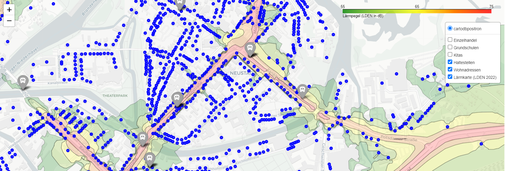
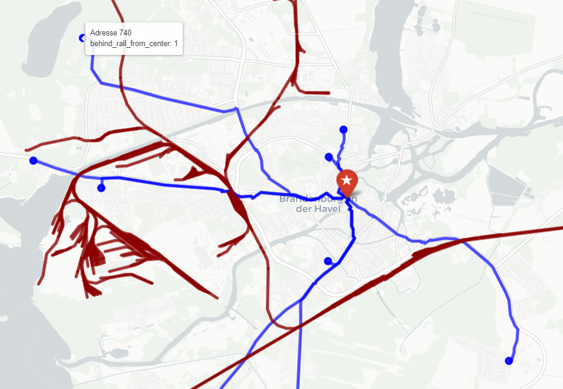
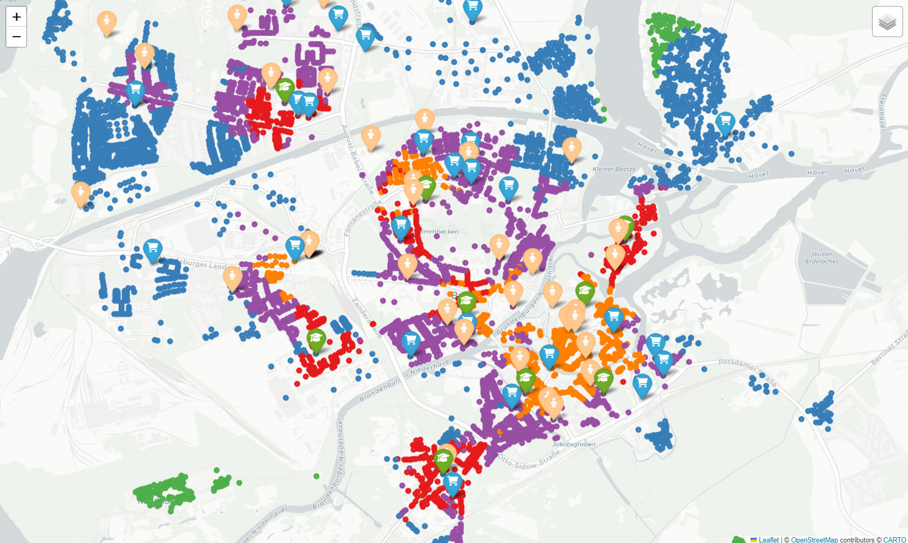
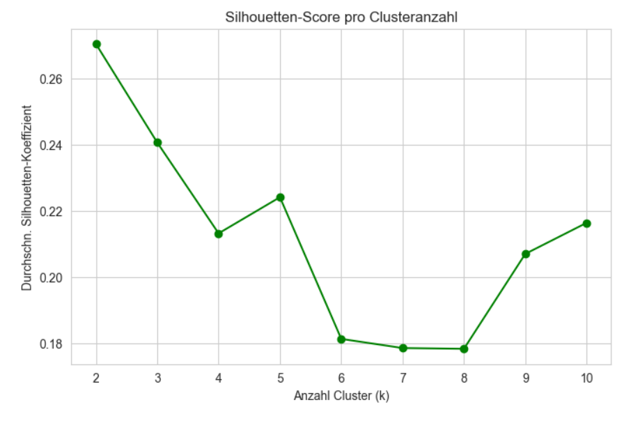
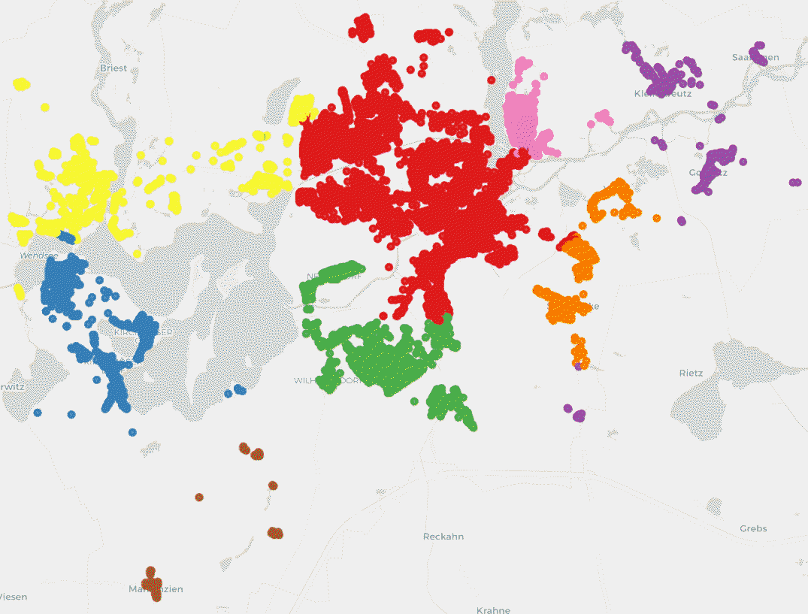
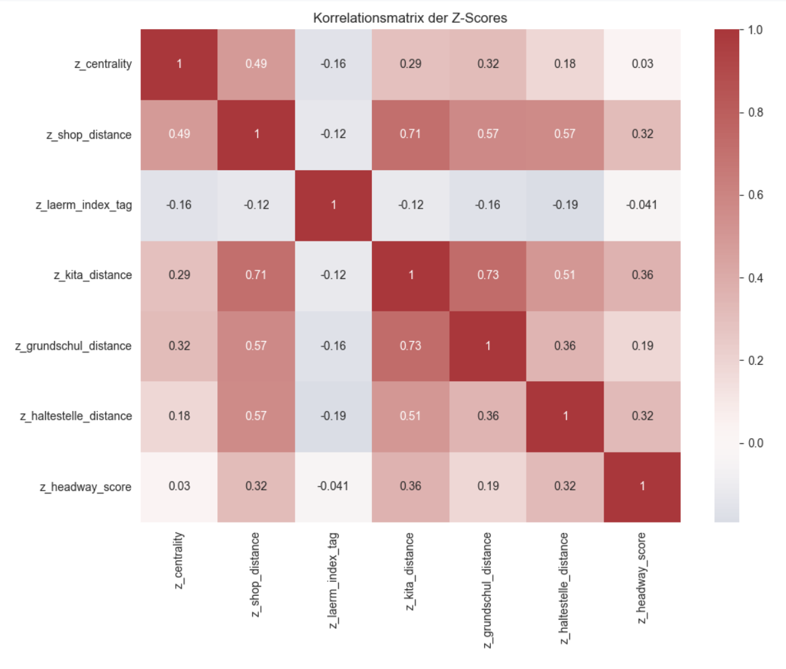
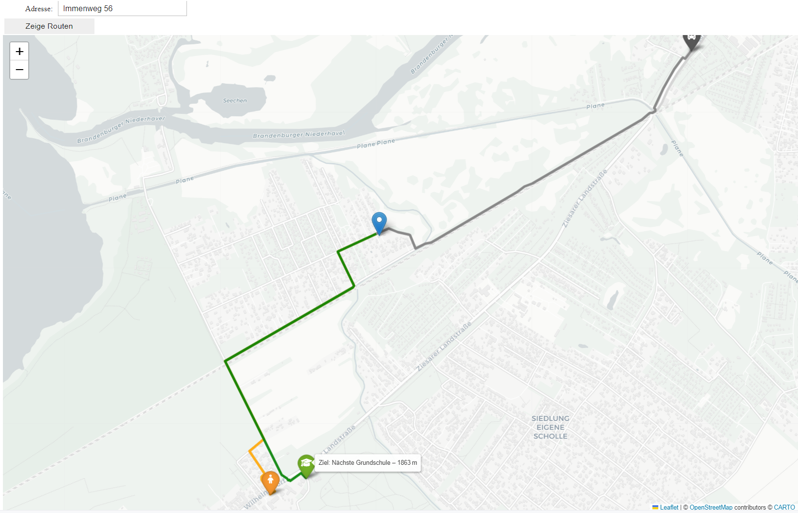

# Wohnlagen-Analyse
Ein Projekt zur systematischen Bewertung von Wohnlagen in der Stadt Brandenburg an der Havel anhand objektiver Kriterien.

## Schnellanleitung: Pipeline ausführen
Diese "Waschanleitung" beschreibt die Reihenfolge, in der die Daten vorbereitet, geocodiert, geroutet und im Notebook ausgewertet werden. Sie richtet sich an Anwender:innen mit Statistik-Hintergrund. Alles, was Serverbetrieb, Docker, API-Schlüssel, Ports, Firewall, Proxy, Datenschutz oder regelmäßige Aktualisierung betrifft, sollte an die IT-Abteilung übergeben werden.

### 1. Zuständigkeiten klären
- **Fach-/Statistik-Anwender:innen** prüfen und aktualisieren die CSV-/Geodaten in `data/`, passen bei Bedarf die Dateinamen am Anfang der Skripte an, starten die Python-Skripte und kontrollieren die Ergebnisdateien in `out/`.
- **IT-Abteilung** richtet Python/Jupyter, Docker, lokale Geocoding-/Routing-Dienste, API-Schlüssel, Netzwerkfreigaben und ausreichend Rechenressourcen ein.
- **Grenze zur IT:** Sobald ein Dienst lokal betrieben werden soll, eine externe API produktiv genutzt wird, Zugangsdaten gebraucht werden oder ein Fehler mit Ports/Netzwerk/Docker auftritt, ist das kein Statistikproblem mehr, sondern IT-Betrieb.

### 2. Arbeitsumgebung vorbereiten
Alle Befehle werden im Projektordner ausgeführt.

```bash
uv sync
```

Alternativ:

```bash
pip install -r requirements.txt
```

Danach sollten die Ordner `data/` mit den Eingangsdaten und `out/` für Zwischenergebnisse vorhanden sein. Falls `out/` fehlt, kann er leer angelegt werden.

### 3. Originaldaten bereitstellen
Die folgenden Originaldaten werden im aktuellen Notebook `wohnlagen_2026.ipynb` direkt verwendet oder dort als Vorverarbeitungsquelle für die benötigten `out/`-Dateien genannt. Sie müssen vor dem Lauf an genau diesen Pfaden bereitstehen:

| Datei | Zweck in der Pipeline | Hinweis |
| --- | --- | --- |
| `data/2026-02-12-Blockgrenzen.gpkg` | Zuordnung der Adressen zu Blöcken und Grundlage für die blockbasierte SKATER-Glättung | Muss eine Spalte `BLOCK` und Geometrien enthalten. |
| `data/Gebaeudetypologie.csv` | Ergänzung der Gebäudetypologie je Adresse | Wird im Notebook direkt geladen. |
| `data/2026_Einzelhandel.csv` | Originaldaten der Einzelhandelsstandorte | Wird mit `crs-conversion.py einzelhandel` zu `out/einzelhandel_geocoded.csv` vorbereitet. |
| `data/2026_Haltestellen.csv` | Originaldaten der ÖPNV-Haltestellen | Wird mit `crs-conversion.py haltestellen` zu `out/haltestellen_geocoded.csv` vorbereitet. |
| `data/Quartiere/2024_Quartiere.gpkg` | Quartiersgrenzen für Karten und räumliche Auswertung | Wird im Kartenteil des Notebooks geladen. |
| `data/ortsteile_brandenburg.json` | Ortsteilgrenzen für Karten und räumliche Auswertung | Wird im Kartenteil des Notebooks geladen. |

Zusätzlich benötigt das Notebook vorberechnete Dateien in `out/`. Diese sind keine Originaldaten, sondern Ergebnisse der Vorverarbeitungsschritte unten:

| Datei | Zweck | Erzeugung |
| --- | --- | --- |
| `out/adressen_geocoded.csv` | Geocodierte Wohnadressen als Basis für alle adressbezogenen Auswertungen | Aus der kundenseitigen Adressliste mit `geocoder.py` oder durch Übernahme bereits vorhandener `lat`/`lon`-Koordinaten. Der Name der Original-Adressdatei ist im aktuellen Notebook nicht fest verdrahtet. |
| `out/adressen_mit_zentrum_routen.csv` | Fußwege und Distanzen der Wohnadressen zur Jahrtausendbrücke | `python routing_zentrum.py` |
| `out/einzelhandel_geocoded.csv` | Einzelhandelsstandorte mit WGS84-Koordinaten | `python crs-conversion.py einzelhandel` |
| `out/adressen_mit_einzelhandel_routen.csv` | Fußwege, Distanzen und 500-m-Zählung zum Einzelhandel | `python routing.py --domain einzelhandel` |
| `out/haltestellen_geocoded.csv` | Haltestellen mit WGS84-Koordinaten | `python crs-conversion.py haltestellen` |
| `out/adressen_mit_haltestellen_routen.csv` | Fußwege, Distanzen, 500-m-Zählung und Linienanzahl für Haltestellen | `python routing.py --domain haltestellen` |
| `out/adressen_mit_laerm.csv` | Lärmindex je Wohnadresse | Separater Lauf von `laerm.ipynb`; für die 2026-Pipeline muss die Datei unter `out/` liegen. |

### 4. Entscheidung: externe Dienste oder lokales Docker-Setup
Für Geocoding und Routing werden Webdienste benötigt. Es gibt zwei Betriebsarten:

- **Externe Dienste:** einfacher Start, aber abhängig von Internet, Nutzungsbedingungen, Datenschutzbewertung und Abruflimits. Für OpenRouteService müssen die aktuellen Beschränkungen vor jedem produktiven Lauf geprüft werden: [openrouteservice.org/restrictions](https://openrouteservice.org/restrictions/).
- **Lokaler Docker-Betrieb:** mehr Einrichtungsaufwand durch die IT, dafür besser für große Batchläufe, reproduzierbarer und weniger abhängig von externen Tageslimits. Details stehen in den Anbieter-Dokumentationen zu [OpenRouteService lokal betreiben](https://giscience.github.io/openrouteservice/run-instance) und [Nominatim per Docker](https://hub.docker.com/r/mediagis/nominatim).

Handreichung für die IT:
- OpenRouteService lokal bereitstellen, sodass Routing-Anfragen unter `http://localhost:8080/ors/v2/directions/foot-walking/geojson` funktionieren.
- Optional Nominatim lokal bereitstellen. Die konkrete interne URL muss in `geocoder.py` als `NOMINATIM_URL` eingetragen werden.
- OSM-/PBF-Datenstand, Speicherbedarf, CPU/RAM, Persistenz der Docker-Volumes, Updates, Backups, Ports und Proxy/Firewall regeln.
- API-Schlüssel nur zentral verwalten und nicht in öffentlich geteilte Dateien schreiben.

### 5. Datenvorverarbeitung und Geocoding
Die Rohdaten liegen in `data/`. Für jeden Datensatz muss am Ende eine Datei mit Koordinaten in WGS84 entstehen, also mit den Spalten `lat` und `lon`.

Zuerst muss die Wohnadressliste zu `out/adressen_geocoded.csv` aufbereitet werden. Diese Datei ist die zentrale Eingabe für Zentrumsrouting, Lärmberechnung und alle späteren Adress-Merges. Wenn die Adressliste noch keine Koordinaten enthält, wird `geocoder.py` verwendet. Wenn die Adressliste bereits Koordinaten enthält, muss sie in dasselbe Format gebracht werden: mindestens `Straßenname`, `Hsnr`, optional `HsnrZus`, `lat`, `lon` und nach Möglichkeit `geometry`.

Wenn bereits amtliche x/y-Koordinaten in EPSG:25833 vorhanden sind, werden sie ohne externes Geocoding umgerechnet:

```bash
python crs-conversion.py haltestellen
python crs-conversion.py einzelhandel
```

Die Lärmbelastung wird separat vorbereitet:

- `laerm.ipynb` lädt die Lärmkartierung und verschneidet sie mit den geocodierten Wohnadressen.
- Für `wohnlagen_2026.ipynb` muss das Ergebnis als `out/adressen_mit_laerm.csv` vorliegen.

Für Adressen oder POI-Listen ohne Koordinaten wird `geocoder.py` verwendet. Vorher oben im Skript `CSV_EINGABE`, `CSV_AUSGABE`, `NOMINATIM_URL`, `RATE_LIMIT` und `USER_AGENT` prüfen und anpassen. Danach:

```bash
python geocoder.py
```

Wichtige Kontrolle nach jedem Schritt: Die erzeugten Dateien in `out/` dürfen nicht leer sein, `lat`/`lon` müssen gefüllt sein und die Koordinaten müssen ungefähr im Stadtgebiet Brandenburg an der Havel liegen.

### 6. Routing berechnen
Vor dem Routing muss OpenRouteService erreichbar sein. Bei lokalem Betrieb sollte die IT bestätigen, dass der Dienst läuft. Die Skripte erwarten standardmäßig:

```text
http://localhost:8080/ors/v2/directions/foot-walking/geojson
```

Zentrumsrouting zur Jahrtausendbrücke:

```bash
python routing_zentrum.py
```

POI-Routing für unterstützte Domains:

```bash
python routing.py --domain einzelhandel
python routing.py --domain haltestellen
```

Die wichtigsten Ergebnisdateien sind:
- `out/adressen_mit_zentrum_routen.csv`
- `out/adressen_mit_einzelhandel_routen.csv`
- `out/adressen_mit_haltestellen_routen.csv`

Für externe OpenRouteService-Nutzung müssen in `routing.py` und `routing_zentrum.py` mindestens `ORS_URL` und `ORS_API_KEY` angepasst werden. Zusätzlich müssen die Abruflimits geprüft und `MAX_WORKERS` ggf. deutlich reduziert werden, damit keine API-Limits verletzt werden. Für große oder regelmäßige Läufe ist der lokale Docker-Betrieb vorzuziehen.

### 7. Notebook ausführen und Ergebnisse prüfen
Jupyter starten:

```bash
jupyter lab
```

Dann `wohnlagen_2026.ipynb` von oben nach unten ausführen. Das Notebook lädt die vorberechneten Geocoding-, Routing-, Lärm-, Typologie- und Blockdaten, führt die Merkmale zusammen und erzeugt die Wohnlagenbewertung.

Am Ende prüfen:
- Exportdateien wie `out/wohnlagen_brb_2026.csv` und `out/wohnlagen_brb_2026.gpkg` wurden geschrieben.
- Die Anzahl der Adressen ist plausibel.
- Distanzspalten enthalten nicht überwiegend leere Werte.
- Karten und Cluster wirken fachlich plausibel.
- In der Konsolenausgabe der Routing-Skripte gibt es keine auffällige Häufung von ORS-Fehlern.

### 8. Vertiefende Hinweise
Die folgenden Abschnitte beschreiben Geocoding und Routing technischer. Sie sind vor allem für Anpassungen an neuen Datenquellen oder für die IT-Übergabe relevant.

## Wohnlagenmodell
Hier wird das eigentliche Modell beschrieben. Die Kombination von objektiven Daten, Clustering und Validierung soll ein robustes, reproduzierbares und transparentes Bewertungsmodell schaffen. So können Veränderungen (z. B. neue Supermärkte, Schließungen von Kitas, geänderte Verkehrsführung) langfristig in die Bewertung integriert werden.

### Kriterien
Das aktuelle 2026-Modell bezieht die folgenden Kriterien ein (Distanzen immer in Metern):
- Fußläufige Distanz zum Zentrum (Jahrtausendbrücke)
- Einzelhandel
    - Fußläufige Distanz zum nächsten Einzelhandel
    - Anzahl von Einzelhandelsmärkten im Umkreis von 500 Metern
- ÖPNV
    - Fußläufige Distanz zur nächsten ÖPNV-Haltestelle
    - Anzahl von ÖPNV-Haltestellen im Umkreis von 500 Metern
    - Anzahl der Linien an der nächsten Haltestelle
- Lärm-Index (laut [Lärmkartierung 2022](https://mleuv.brandenburg.de/mleuv/de/umwelt/immissionsschutz/laerm/umgebungslaerm/laermkartierung/#))
- Lage vor bzw. hinter Bahnübergängen vom Stadtzentrum aus


Abbildung 1: Visualisierung des gemessenen Lärm-Index mit Adressen

Das Modell kann beliebig um neue Kriterien erweitert werden. Denkbar sind zum Beispiel auch neue Kriterien wie "zwischen der Adresse und dem Zentrum gibt es einen Bahnübergang" oder Ähnliches. Dadurch kann die Trennschärfe des Modells verbessert werden, was anhand der Gütemaße (s.u.) sichtbar werden sollte.


Abbildung 2: Visualisierung der Querung von Bahnübergängen (Beispiel)

Die **Kriterien fließen gewichtet in das Modell** ein. Diese Gewichtung ist nur vorläufig definiert und sollte für den langfristigen Einsatz möglichst festgeschrieben werden.

### Clustering-Ansatz

Der aktuelle Hauptansatz zur Bildung der Wohnlagen ist **SKATER auf Blockebene**. Dafür werden die adressbezogenen Merkmale zunächst auf Blockgrenzen aggregiert. Anschließend bildet SKATER räumlich zusammenhängende Cluster. Diese Cluster entsprechen den Wohnlagenkategorien und werden danach wieder den enthaltenen Adressen zugeordnet.

Der Vorteil gegenüber einer rein adressbezogenen Clusterung ist, dass Wohnlagen nicht als verstreute Einzelpunkte entstehen, sondern als räumlich nachvollziehbare Flächen. Das passt besser zur fachlichen Erwartung an Wohnlagen und erleichtert die spätere Plausibilisierung auf Karten.

In einer visuellen Plausibilitätsprüfung (vgl. Abbildung 2) ergeben sich gut nachvollziehbare Cluster, wie zum Beispiel "orange" als zentrumsnahe Lage mit sehr guter Nahversorgung in allen definierten Kriterien. Das blaue Cluster zeigt Adressen in Randlagen. 

Es wird aber immer auch **Abweichungen von der subjektiven Bewertung** geben. Diese "gefühlten" Abweichungen können mehrere Gründe haben:
- Es gibt Kriterien, die die Wohnlage erheblich beeinflussen, aber noch nicht im Modell enthalten sind. In dem Fall können die Daten einfach ergänzt und in das Gewichtungsmodell eingefügt werden.
- Es treten subjektive Fehlannahmen auf, z. B. ein historisch oder in der Bevölkerung als "schlecht" wahrgenommenes Viertel, das nach sachlichen Kriterien aber aktuell besser bewertet wird.

Das gewählte Clustering-Verfahren erzeugt insgesamt eine datenbasierte, objektiv überprüfbare und erweiterbare Grundlage für die Einteilung von Wohnlagen. Je mehr relevante Daten eingefügt werden, desto präziser wird das Modell.


Abbildung 3: Frühere Vergleichsdarstellung einer adressbezogenen K-Means-Clusterung mit Kitas, Schulen, Haltestellen, Supermärkten und Zentrumsnähe als Kriterien.

Die Wahl der Clusteranzahl erfolgt nicht willkürlich, sondern orientiert sich an **statistischen Gütekriterien** und fachlicher Plausibilität. Im Notebook werden dazu unter anderem Kennzahlen und Kartendarstellungen erzeugt. So wird geprüft, ob die Cluster trennscharf genug sind und die räumlichen Ergebnisse sinnvoll zusammenhängende Wohnlagen bilden.


Abbildung 4: Silhouette-Score (Beispiel) für verschiedene Cluster-Anzahl

### Verhältnis zu K-Means
K-Means wird nicht mehr als vorherrschender Ansatz genutzt, sondern nur noch als Vergleichs- und Analysevariante. Die entsprechende Herleitung und PCA-/K-Means-Auswertung liegt im Notebook `wohnlagen_kmeans_pca.ipynb`.

Für die eigentliche Wohnlagenbildung ist `wohnlagen_2026.ipynb` maßgeblich. Dort steht die blockbasierte SKATER-Auswertung im Vordergrund.


Abbildung 5: Beispielhafte Wohnlagen mit SKATER auf Blockebene mit 7 Clustern

### Validierung
Um die Qualität der Ergebnisse zu prüfen, werden verschiedene Validierungsschritte genutzt:

- Interne Validierung: Kennzahlen wie Silhouette-Koeffizient oder Davies-Bouldin-Index bewerten, wie klar die Cluster voneinander getrennt sind.

- Externe Plausibilisierung: Die Clustereinteilung wird mit bekannten Wohnlagen aus Mietspiegeln oder Einschätzungen von Expert:innen verglichen. So lässt sich überprüfen, ob die automatisch ermittelten Lagen mit der städtischen Realität übereinstimmen.

- Geografische Kohärenz: Da Wohnlagen räumlich zusammenhängend sein sollten, wird zusätzlich kontrolliert, ob die resultierenden Cluster zusammenhängende Flächen bilden oder ob Adressen „versprengt“ erscheinen.


Abbildung 6: Beispielhafte Korrelationen zwischen Kriterien

### Einschränkung der Validität
Die Bewertung der Merkmale erfolgt über Z-Scores, also standardisierte Abweichungen vom Mittelwert. Dadurch ist die Einordnung relativ zur jeweils betrachteten Gesamtheit: Eine Adresse wird besser bewertet, wenn sie im Vergleich zu anderen Adressen günstigere Werte aufweist.

Das bedeutet jedoch nicht zwingend, dass eine Verbesserung an einem Ort automatisch die Verschlechterung eines anderen nach sich zieht. Dieser Nullsummen-Effekt tritt nur dann auf, wenn die Standardisierung bei jeder Berechnung neu auf die aktuelle Stichprobe bezogen wird. Wird hingegen eine feste Baseline (z. B. Stand eines bestimmten Jahres) definiert, lassen sich Wohnlagen auch über längere Zeiträume absolut vergleichen, sodass kollektive Verbesserungen oder Verschlechterungen (z. B. durch infrastrukturelle Veränderungen) sichtbar werden.

> **Empfehlung:**
> Für eine langfristig belastbare Wohnlagenbewertung sollte eine Baseline festgelegt werden, an der zukünftige Entwicklungen gemessen werden. So können Veränderungen wie die Eröffnung neuer Supermärkte oder die Schließung einer Kita objektiv erfasst werden, ohne dass sich automatisch die Bewertung anderer Wohnlagen verschiebt.


## Aufbau
Das aktuelle Hauptdokument ist das Jupyter-Notebook ```wohnlagen_2026.ipynb```. Das ältere Notebook ```wohnlagen.ipynb``` enthält weiterhin Herleitungen und frühere Analysevarianten.

Für die korrekte Ausführung wird ein Ordner ```/data``` erwartet, in dem sich die Adressen und weitere Datenquellen befinden. Die erwarteten Dateinamen finden sich im Notebook.

Weiterhin gibt es einige Hilfs-Skripte zur Automatisierung der Datenvorverarbeitung, die in den jeweiligen Abschnitten beschrieben werden.

Die gezeigten Diagramme und interaktiven Karten können alle mithilfe des Notebooks erzeugt werden.

  
Abbildung 7: Kartenanwendung zur Darstellung einer Adresse mit ermittelten Wegen zu den POIs

## Geocoding
Geocoding bedeutet: Aus einer textlichen Adresse werden Koordinaten (`lat`, `lon`). Wenn ein Datensatz bereits amtliche x/y-Koordinaten enthält, ist Geocoding nicht nötig; dann reicht die Umrechnung mit `crs-conversion.py`.

Für größere Adresslisten sollte ein Nominatim-Server in einem lokalen Docker-Container verwendet werden (s. [Nominatim-Docker-Anleitung](https://hub.docker.com/r/mediagis/nominatim)). Die konkrete URL hängt vom IT-Setup ab und wird in `geocoder.py` als `NOMINATIM_URL` eingetragen. Anfragen sehen dann z. B. so aus:
```
GET http://<nominatim-host>/search?addressdetails=0&q=Hauptstraße,brandenburg%20an%20der%20havel&format=jsonv2
```

Mit dem Skript ```geocoder.py``` können CSV-Dateien mit den Spalten "Straßenname" (oder "Straßennamen"), "Hsnr" und "HsnrZus" geocodiert werden. Die Eingabe- und Ausgabedatei werden oben im Skript über `CSV_EINGABE` und `CSV_AUSGABE` festgelegt; die Ausgabe sollte in der Regel unter `out/*_geocoded.csv` liegen.

Bus- und Straßenbahnhaltestellen sind mit lokalem Nominatim und OSM-Daten teilweise schwer zu finden. Dafür wurde stellenweise der offizielle Nominatim-Server von [OpenStreetMap](https://nominatim.openstreetmap.org/) unter Beachtung der Fair-Use-Regeln verwendet. Für größere oder wiederholte Läufe sollte diese Entscheidung vorher mit der IT abgestimmt werden.

## Routing
Routing bedeutet: Aus zwei Koordinaten wird eine reale Fußwegdistanz entlang des Wegenetzes berechnet. Das Routing erfolgt über die [OpenRouteService API](https://openrouteservice.org/), entweder als externer Dienst mit Abrufbeschränkungen oder in einem lokalen Docker-Container (s. [ORS-Anleitung](https://giscience.github.io/openrouteservice/run-instance)). Die jeweils aktuellen externen Beschränkungen stehen unter [openrouteservice.org/restrictions](https://openrouteservice.org/restrictions/).

Bei lokalem Einsatz wird die API standardmäßig über folgende URL aufgerufen:
```
POST http://localhost:8080/ors/v2/directions/foot-walking/geojson
```

Im HTTP Body werden die Koordinaten (erste = Startpunkt, zweite = Zielpunkt) und Parameter für die Rückgabe (geometry = Wegpunkte) übergeben:
```json
{
    "coordinates": [
        [
            12.547222024194422,
            52.43275265
        ],
        [
            12.547222024194422,
            52.43275265
        ]
    ],
    "instructions": false,
    "geometry": true,
    "preference": "recommended"
}
```

Für die normale Ausführung müssen diese HTTP-Anfragen nicht von Hand gebaut werden. Die Skripte `routing_zentrum.py` und `routing.py` senden die Anfragen automatisch und schreiben die vorberechneten Distanz- und Routendateien nach `out/`.


## Verbesserungsmöglichkeiten
- Ergänzung einer Spalte "stadtteil" für Visualisierung und Vergleich mit bestehendem Bewertungsmodell anhand der Stadtteile (= "Wie sehr entsprechenden die historischen Stadtteile den objektiven Wohnlagen?")
- POIs (Points of Interest) wie Schulen, Kindergärten, Haltestellen, Ärzte, Apotheken, Supermärkte und Restaurants könnten zukünftig über die Overpass API von OpenStreetMap ermittelt werden. Dadurch entfällt die manuelle Pflege von CSV-Dateien. Es müssen nur jeweils die aktuellen Daten aus OSM-Karten bezogen werden, die bedarfsgerecht und öffentlich verfügbar gepflegt werden können (z. B., ob Kitas tatsächlich noch geöffnet sind).
- Mögliche weitere Faktoren für Wohnlagenbestimmung:
   - Makrolage (Nähe Berlin, Autobahn, Flughafen, Risiko von Naturkatastrophen, Entwicklungsprognose laut [Zukunftsatlas](https://www.prognos.com/de/projekt/zukunftsatlas-2019) oder [Wegweiser Kommune](https://www.wegweiser-kommune.de))
   - Aussicht (Blick auf Wasser, Wald, Stadt, Sehenswürdigkeiten)
